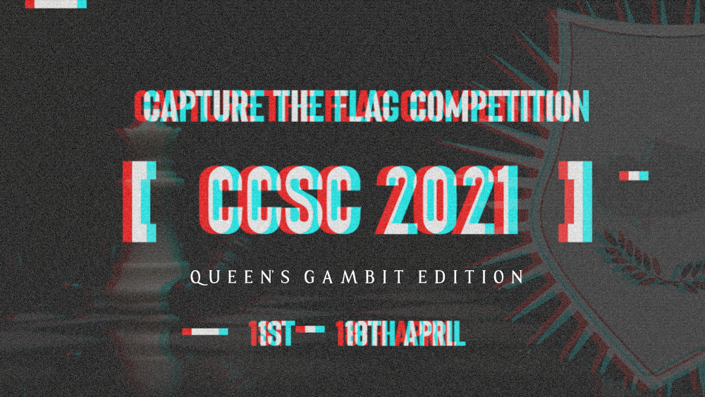

## Repository Structure

This is the official repository with the challenges published in CCSC CTF 2021. Each challenge has a `public` and `setup` folder (if applicable) and is accompanied with a short description. The `setup` folder contains all the files required to build and host the challenge and usually contains the flag and a proof of concept solution as well. Alternatively, the `public` folder contains the files that are released to the participant during the competition.

## Dependencies

Although some of the challenges may run as is, it is recommended that you have **docker** and **docker-compose** installed and use the provided scripts to run the challenges to ensure isolation and therefore proper environment setup.

For a more detailed description of the folder structure for challenges, please see the [Jeopardy Creation Guide](https://www.notion.so/Jeopardy-CTF-Challenge-Creation-770b62e8556442a3826cb6593d6affa4) on the Cybermouflons wiki.

## Reserved Ports
Port 8000 will be used for serving static artifacts

## Challenges

### Artificial Intelligence

| Name                         | Author             | Ports |
| ---------------------------  | ------------------ | ----- |
| [Neuralmate](ai/neuralmate)  | \_Roko'sBasilisk\_ | 4000  |

### Blockchain

| Name                                       | Author               |
| ------------------------------------------ | ------               |
| [Lucky Moves](blockchain/lucky-moves)      |  \_Roko'sBasilisk\_  |

### Crypto

| Name                                                | Author             | Ports    |
| --------------------------------------------------- | ------------------ | -------- |
| [Queen's Encryption](crypto/queens-encryption)      | koks               | -        |
| [Less Said the Better](crypto/less-said-the-better) | \_Roko'sBasilisk\_ | -        | 
| [Singularity](crypto/singularity)                   | \_Roko'sBasilisk\_ | -        |
| [Forced Draw](crypto/forced-draw)                   | koks               | -        |
| [Confusing Moves](crypto/confusing-moves)           | \_Roko'sBasilisk\_ |5000, 8081|
| [Rookie's Base](crypto/rookie's-base/README.md)     | s1kk1s             | -   |
| [PokePawn II](web/pokepawn)                         | \_Roko'sBasilisk\_ | -     |

### Forensics

| Name                                    | Author             |
| --------------------------------------- | ------------------ |
| [Protochess](forensics/protochess)      | \_Roko'sBasilisk\_ |
| [The Janitor](forensics/the-janitor)    | voldemort          |
| [The Janitor 2](forensics/the-janitor-2)  | voldemort          |
| [Exchanges](forensics/exchanges)        | voldemort          |
| [One of a kind](forensics/one-of-a-kind)| voldemort          |

### Misc

| Name                        | Author | Ports|
| ----------------------------| -------| -----|
| [Botgov](misc/botgov)       | koks   | -    |
| [Cap-i-sh](misc/cap-i-sh)   | ishtar | 6666 |
| [Afterload](misc/afterload) | ishtar | 6667|

### Pwn

| Name                                      | Author | Ports |
| ------------------------------------------| ------ | ----- |
| [Caro-Kann Defence](pwn/caro-kann)        | s3nn   | 1337  |
| [Doubled Pwns](pwn/doubled%20pwns)        | s3nn   | 2337  |
| [Two Knights](pwn/two%20knights)          | s3nn   | 3337  |
| [Resignation](pwn/resignation)            | s3nn   | 4337  |
| [Chessanalyzer](pwn/chessanalyzer)        | R3D    | 41337 |
| [Ask me anything](pwn/ask%20me%20anything)| R3D    |51337  |
| [Chess Portal](pwn/chess%20portal)        | R3D    | 1991  |

### Reverse

| Name                                       | Author             | Ports |
| ------------------------------------------ | ------------------ | ----- |
| [Make Your Mov](reverse/make-your-mov)    | s1kk1s             | -     |
| [Fortified Walls](reverse/fortified-walls) | \_Roko'sBasilisk\_ | 5555  |
| [Reverse Gambit](reverse/reverse_gambit)   | k3rnel0            | ?     |

### Stego

| Name                                                                      | Author    |
| ------------------------------------------------------------------------- | --------- |
| [The New Zealand Chess Chronicle](stego/The_New_Zealand_Chess_Chronicles) | superhedgy|
| [the Queen's Royal invitational](stego/the-Queens-Royal-invitational)     | s1kk1s    |
| [How Convenient](stego/how-convenient)                                    | koks      |
| [Tweetable](stego/tweetable)                                              | R3D       |
| [Talent or Skill](stego/talent%20or%20skill)                              | R3D       |

### Web

| Name                                             | Author             | Ports |
| ------------------------------------------------ | ------------------ | ----- |
| [Duncan Chess Academy](web/duncan-chess-academy) | \_Roko'sBasilisk\_ | 8080  |
| [Chess Trickery](web/chess-trickery)             | styx00             | 80    |
| [Wasmate](web/wasmate)                           | \_Roko'sBasilisk\_ | 3000  |
| [Synchronous Chess](web/synchronous-chess)       | styx00             | 7000  |
| [Cate Bianca](web/cate-bianca)                   | styx00             | 7500  |
| [PokePawn I](web/pokepawn)                       | \_Roko'sBasilisk\_ | -     |
